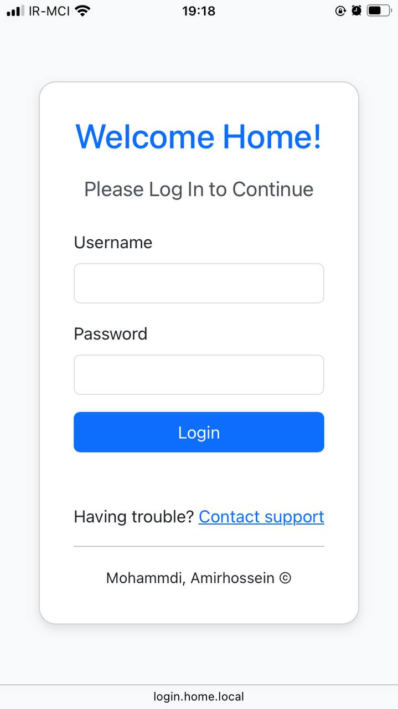
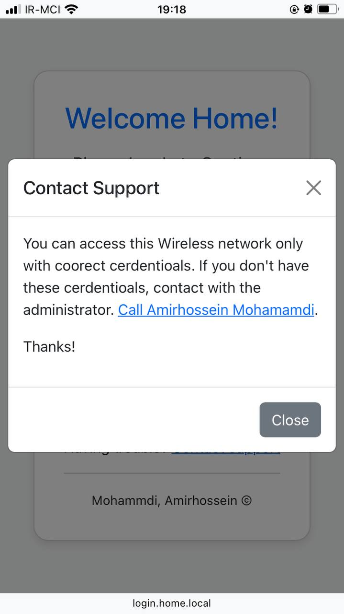

# Mikrotik Captive Portal

This repository contains the **Captive Portal** setup for my home wireless network, powered by **Mikrotik Router**.

## Features

- Custom-designed login page using Bootstrap.
- User-friendly interface for accessing the wireless network.
- Error handling for incorrect login credentials (e.g., invalid username or password).
- Integrated **Mikrotik Router** functionalities for network access control.

## Screenshots

Below are two screenshots showcasing the custom login page and error handling feature.

  
  

## Setup Instructions

### Prerequisites

- **Mikrotik Router** with hotspot functionality.
- Basic knowledge of Mikrotik router configuration.

### Steps

1. Upload the custom login page to the Mikrotik router using Winbox or FTP.
2. Modify the HTML and CSS files as needed to customize the page further.
3. Ensure that Bootstrap is available offline or through local hosting on the router.
4. Set up the hotspot and link the login page using the Mikrotik interface.

### Offline Bootstrap

To ensure that the **Bootstrap** library loads without internet access:

1. Download the Bootstrap CSS and JS files from [Bootstrap Official Website](https://getbootstrap.com).
2. Replace the CDN links in the HTML with the locally downloaded files.
3. Upload the Bootstrap files to the Mikrotik router alongside the HTML page.

### Mikrotik Router Configuration

1. Configure the hotspot settings in the Mikrotik router to use the custom login page.
2. Make sure to adjust the **error handling** section in the login page to display invalid credentials correctly.

## License

This project is licensed under the MIT License.
